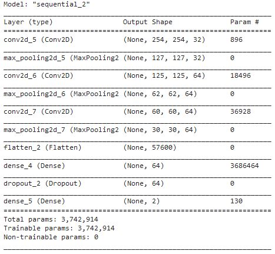
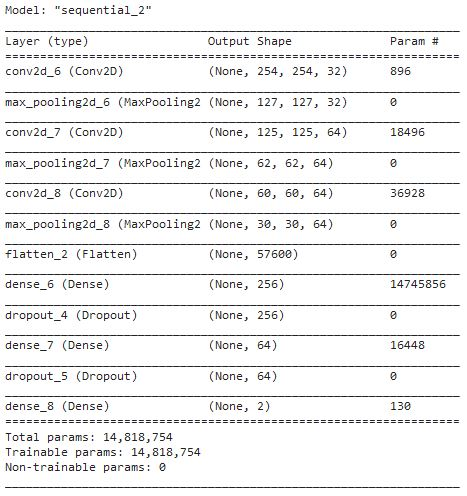
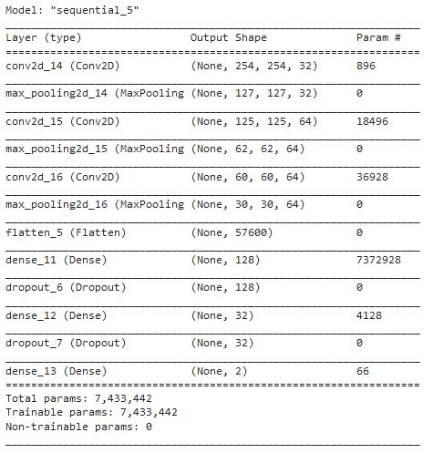

# Powdery Mildew Detection

# Table of Contents

- [Powdery Mildew Detection](#powdery-mildew-detection)
- [Table of Contents](#table-of-contents)
  - [Dataset Content](#dataset-content)
  - [Business Requirements](#business-requirements)
  - [Hypothesis and how to validate?](#hypothesis-and-how-to-validate)
  - [The rationale to map the business requirements to the Data Visualisations and ML tasks](#the-rationale-to-map-the-business-requirements-to-the-data-visualisations-and-ml-tasks)
  - [ML Business Case](#ml-business-case)
  - [Dashboard Design](#dashboard-design)
  - [Unfixed Bugs](#unfixed-bugs)
  - [Model Design](#model-design)
    - [Input](#input)
    - [Hidden Layers](#hidden-layers)
    - [Output Layer](#output-layer)
    - [Model Refinement](#model-refinement)
  - [Final Result](#final-result)
  - [Deployment](#deployment)
    - [Heroku](#heroku)
  - [Main Data Analysis and Machine Learning Libraries](#main-data-analysis-and-machine-learning-libraries)
  - [Credits](#credits)

## Dataset Content

- The dataset is sourced from [Kaggle](https://www.kaggle.com/codeinstitute/cherry-leaves). We then created a fictitious user story where predictive analytics can be applied in a real project in the workplace.
- The dataset contains +4 thousand images taken from the client's crop fields. The images show healthy cherry leaves and cherry leaves that have powdery mildew, a fungal disease that affects many plant species. The cherry plantation crop is one of the finest products in their portfolio, and the company is concerned about supplying the market with a compromised quality product.

## Business Requirements

The cherry plantation crop from Farmy & Foods is facing a challenge where their cherry plantations have been presenting powdery mildew. Currently, the process is manual verification if a given cherry tree contains powdery mildew. An employee spends around 30 minutes in each tree, taking a few samples of tree leaves and verifying visually if the leaf tree is healthy or has powdery mildew. If there is powdery mildew, the employee applies a specific compound to kill the fungus. The time spent applying this compound is 1 minute.  The company has thousands of cherry trees, located on multiple farms across the country. As a result, this manual process is not scalable due to the time spent in the manual process inspection.

To save time in this process, the IT team suggested an ML system that detects instantly, using a leaf tree image, if it is healthy or has powdery mildew. A similar manual process is in place for other crops for detecting pests, and if this initiative is successful, there is a realistic chance to replicate this project for all other crops. The dataset is a collection of cherry leaf images provided by Farmy & Foods, taken from their crops

- 1 - The client is interested in conducting a study to visually differentiate a healthy cherry leaf from one with powdery mildew.
- 2 - The client is interested in predicting if a cherry leaf is healthy or contains powdery mildew.

## Hypothesis and how to validate?

  1. The leaves infected with powdery mildew have patches of white discoloration on the leaf.
     - An average image study will be useful to investigate this. We are expecting the average powdery mildew image to show white patches where the powdery mildew is present. We will compare the healthy to the powdery mildew average image and we expect to not see white patches on the average healthy image.
  2. Healthy leaves have a more uniform, greener color.
     - An average variability image study will be useful to investigate this. We expect to see a dark area on the healthy variability image, meaning that the leaves have a more consistant color. And for the powdery mildew, we expect to see more lighter areas all over the leaf in the variavility image indicating that the powdery mildew leaves are not a consistant green color.
  3. Infected leaves have overall smoother edges, and a less defined "leaf" shape.
     - An average image study will be useful to investigate this. We will use the difference of average healthy and average powdery mildew images. We expect to see a lighter area around the outline of the leaves, which indicate that the edges of the leaves are different when it is healthy to when it has powdery mildew.

## The rationale to map the business requirements to the Data Visualisations and ML tasks

1. The client is interested in conducting a study to visually differentiate a healthy cherry leaf from one with powdery mildew.
    - We will display the "mean" and "standard deviation" images for healthy and infected leaves.
    - We will display the difference between an average healthy leaf and an average infected leaf.
    - We will display a image montage for either healthy or infected leaves.

2. The client is interested in predicting if a cherry leaf is healthy or contains powdery mildew.
   - We want to predict if a given leaf is infected or not with powdery mildew.
   - We want to build a binary classifier and generate reports.

## ML Business Case

1. What are the business requirements?
        - The client is interested in conducting a study to visually differentiate a cherry leaf that is healthy from one that contains powdery mildew.
        - The client is interested in predicting if a cherry leaf is healthy or contains powdery mildew.
2. Is there any business requirement that can be answered with conventional data analysis?
        - Yes, we can use conventional data analysis to conduct a study to visually differentiate a cherry leaf that is healthy from one that contains powdery mildew.
3. Does the client need a dashboard or an API endpoint?
        - The client needs a dashboard.
4. What does the client consider as a successful project outcome?
        - A study showing how to visually differentiate a cherry leaf that is healthy from one that contains powdery mildew.
        - Also, the capability to predict if a cherry leaf is healthy or contains powdery mildew.
5. Can you break down the project into Epics and User Stories?
        - Information gathering and data collection.
        - Data visualization, cleaning, and preparation.
        - Model training, optimization and validation.
        - Dashboard planning, designing, and development.
        - Dashboard deployment and release.
6. Ethical or Privacy concerns?
        - The client provided the data under an NDA (non-disclosure agreement), therefore the data should only be shared with professionals that are officially involved in the project.
7. Does the data suggest a particular model?
        - The data suggests a binary classifier, indicating whether a particular cherry leaf is healthy or contains powdery mildew.
8. What are the model's inputs and intended outputs?
        - The input is a cherry leaf image and the output is a prediction of whether the cherry leaf is healthy or contains powdery mildew.
9. What are the criteria for the performance goal of the predictions?
        - We agreed with the client a degree of 97% accuracy.
10. How will the client benefit?
        - The client will not supply the market with a product of compromised quality.

## Dashboard Design

Page 1: Quick project summary
    -	General Information
        -	Powdery Mildew is a fungal disease that affects a wide range of plants. This disease can significantly reduce a plants yield.
        -	The symptoms of a plant infected with Powdery Mildew are powdery white spots that appear on the leaves and stems of the plant. These spots grow larger and denser as the disease progresses.
        -	There are treatments for infected plants, but it is time consuming to identify infected plants.
        -	A leaf is obtained from a suspected plant, and photographed. Visual criteria are used to detect if powdery mildew is present.
    -	Project Dataset
        -	The given dataset contains over 4000 images in total, half of which are of single healthy leaves and the rest are of single leaves infected with powdery mildew.
    -	Business Requirements
        -	The client is interested in conducting a study to visually differentiate a cherry leaf that is healthy from one that contains powdery mildew.
        -	The client is interested in predicting if a cherry leaf is healthy or contains powdery mildew.

Page 2: Leaf Visualizer

    -	Will answer business requirement 1
        -	Cb1: Difference between average and variability image
        -	Cb2: Difference between average healthy and infected leaves
        -	Cb3:  ? Show image refining process (show borders on infected leaf)
        -	Cb3: Image montage

Page 3: Powdery Mildew Detection

    -	Will answer business requirement 2
    -	Link to download healthy and infected leaves for live prediction
    -	File uploader widget
    -	Table with image name and prediction result
    -	Download table

Page 4: Project hypothesis and Validation

    -	Section for each hypothesis, conclusion and how it was validated

Page 5: ML Prediction Metrics
    -	Label frequencies in each image set
    -	Model history
    -	Model evaluation result

## Unfixed Bugs

There are no known bugs.

## Model Design

Loss function is "categorical_crossentropy", as we want the model to predice wether the imnage belongs to one of two categories.

Optimizer is "adam", as seen used in [WalkthroughProject01]{#reference_1}.

Metrics is "accuracy", because we want to train the model to correctly predict the category of the image.

Model Summary

### Input

The imput for this model is a 256 X 256 x 3 array representing an image of a leaf that is either healthy or infected with powdery mildew.

### Hidden Layers

1. A set of 3 convolution + pooling layers which allows the network to discover complex patterns within patterns.

2. A flatten layer to convert the matrix to a vector.
3. A dense layer with 64 nodes, and the activation function 'relu'
4. A dropout layer with a value of 0.5, this reduces the chance of the model overfitting

### Output Layer

A dense layer with 2 nodes, activation function of softmax to ensure the output is one or the other, healthy or powdery mildew

### Model Refinement

Model v1:
Initial model, first danse layer nodes equals image shape width. Gradually condenses nodes into 2 output nodes.
Has over 14.5 million trainable parameters. This model is too large for the task it is assigned to.

Model v2:
Achieved similar accuracy to v1, while having half the number of trainable parameters.

Model v3:
Achieved similar accuracy to v2, while having half the number of trainable parameters. A quarter of the size of v1.

## Final Result

The model met the required accuracy of +97% with an accuracy of over 99% on the validation set.
The model used for the dashboard is v2, as it is the most accurate.

## Deployment

### Heroku

- The App live link is: [https://powdery-mildew-kristfur-1b27c28aaef5.herokuapp.com/](https://powdery-mildew-kristfur-1b27c28aaef5.herokuapp.com/)
- Set the runtime.txt Python version to a [Heroku-20](https://devcenter.heroku.com/articles/python-support#supported-runtimes) stack currently supported version.
- The project was deployed to Heroku using the following steps.

1. Log in to Heroku and create an App
2. At the Deploy tab, select GitHub as the deployment method.
3. Select your repository name and click Search. Once it is found, click Connect.
4. Select the branch you want to deploy, then click Deploy Branch.
5. The deployment process should happen smoothly if all deployment files are fully functional. Click now the button Open App on the top of the page to access your App.
6. If the slug size is too large then add large files not required for the app to the .slugignore file.

## Main Data Analysis and Machine Learning Libraries

Kaggle

- Used to obtain the cherry leaves dataset

pandas

- Used to manipulate data

numpy

- Used to manipulate data

matplotlib

- Used to create plots

seaborn

- Used to create plots

joblib

- Used to save and load pkl file

tensorflow

- Used to create machine learnign model

## Credits

- The information for the text on the dashboard summary page was taken from [Wikipedia](https://en.wikipedia.org/wiki/Powdery_mildew).
  
- [Walkthrough Project 01](https://github.com/Code-Institute-Org/WalkthroughProject01) Project 01 - Code Institute 
  * Was used as a rferance for machine learning model and streamlit dashboard
  
- [Code Institute](https://learn.codeinstitute.net) Predictive Analysis / ML:TesnsorFlow
  * Was used to create model
